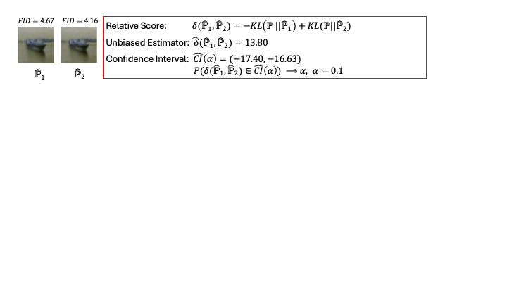

# Statistical Inference for Generative Model Comparison

This repository contains the code to reproduce the experiments in the paper: **[Statistical Inference for Generative Model Comparison](https://arxiv.org/pdf/2501.18897).**

## Overview

We develop a method for comparing how close different generative models are to the underlying distribution of test samples. Our approach employs the Kullback-Leibler (KL) divergence to measure the distance between a generative model and the unknown test distribution, the relative KL divergence admits a crucial cancellation of the hard-to-estimate term to enable the faithful uncertainty quantification. Code to reproduce all of our experiments can be found in the experiments folder.

